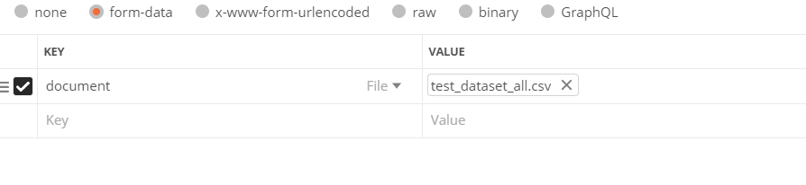

# To Run this project
1) Get the Repository on your system to run the code
2) to start the server navigate to project folder in the terminal and run 'npm run dev' command

# Different Routes and their usecase  
## 1) localhost:5000/user/register    
     -> Post Request 
     -> To Register the user who is authorised to    send or receive data.
   

## 2) localhost:5000/user/signin     
     -> Post Request 
     -> User will signin using this route and will also 
       get the authentication token which will be used to authenticate the user's each request.
   
     image of data 

## 3) localhost:5000/device/register/:userid
    -> localhost:5000/device/register/60b07acd956e511e6033a839
    -> Post Request 
    -> This url is used to register a device 
       the user who is registering this device 
       their user id will also be passed as a parameter
       Image of data to be sent 
     

     Header's image 
     

     header also contain an authorization field 
     which will be used to authenticate the user

 ##  4)  localhost:5000/reading/bulkupload/:userid
     -> localhost:5000/reading/bulkupload/60b07acd956e511e6033a839  
     -> Post Request 
     -> Also requires authenticated user so user id  is given  in the params and 
        token is also set in the header. 
     -> Bulk Insert Operation using a csv  
     -> Will take csv as a input and insert the reading from different devices at once. 
     -> Will return the row's no which contain irrevelant data i.e unregisterd device name,wrong date format etc. 
 Sent as form data  
   
 

 ## 5) localhost:5000/reading/getdevicedata/:userid
     -> localhost:5000/reading/getdevicedata/60b07acd956e511e6033a839  
     -> Post Request 
     -> Requires user authentication so userID is their in params and authentication token is also set.    
     -> Can be used to get data from different devices
        and choice of data can be given
        such as 
          1) which fields to extract p10,p25 etc.
          2) array of devices 
          3) time range given as gt and lt 
     Data should be given in same format given  
     
 
## 6) localhost:5000/reading/getdata/:userid
     -> Get All Readings in a time range
     -> Post Request
     -> Requires user authentication so userID is their in params and authentication token is also set.    
     -> Data sent in form
     

